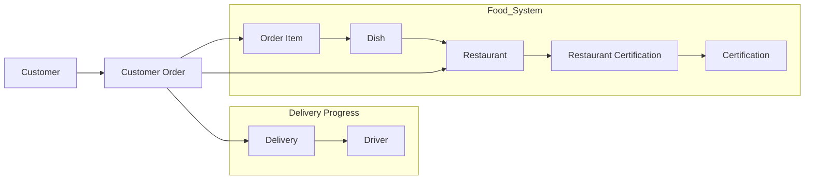

# 🍜 FineFoods4U Food Delivery Database System   Relational Database Design | SQL Implementation

## Project Overview

This repository documents the design and implementation of a relational database system for a fictional food delivery platform called FineFoods4U.  
The project demonstrates the complete lifecycle of database engineering, including:  

- Entity-Relationship modelling
- Relational schema design
- Database normalization (3NF)
- SQL database implementation
- Analytical SQL queries & views

The database was designed to support both operational and analytical requirements of a food delivery system.  

Key objectives include:

- Structuring platform data using a normalized relational schema
- Enforcing referential integrity and domain constraints
- Supporting efficient retrieval of operational data
- Generating business insights through SQL reporting queries

Example analytical requirements include:

- Identifying vegetarian dishes available within a specific preparation time
- Analysing delivery performance
- Tracking driver delivery histories
- Determining restaurant order volumes
- Generating restaurant menu listings

## Database Engineering Workflow
The project followed a structured database development workflow.

## Core Database Entities

The database schema consists of several key entities:
| Entity | Description |
| ----- | ----- |
| Customer | Registered users of the platform who place food orders. |
| Restaurant | Food vendors offering dishes available for delivery. |
| Dish | Individual menu items associated with restaurants. |
| Driver | Delivery personnel responsible for transporting orders. |
| CustomerOrder | Orders placed by customers. |
| OrderItem | Individual dishes within an order. |
| Certification | Food safety or quality certifications assigned to restaurants. |
| RestaurantCertification | Linking entity connecting restaurants and certifications. |
| Suburb | Geographical delivery zones used to coordinate orders and drivers. |

## Database Structure

This structure ensures data consistency, scalability, and normalized relationships between entities.

## Key Database Concepts Demonstrated
This project covers the full lifecycle of relational database engineering:

### Database Design

- Entity Relationship modelling
- Relational schema development
- Domain and integrity constraints

### Data Integrity

- Primary keys
- Foreign keys
- Referential integrity

### Database Optimization

- Normalization up to Third Normal Form (3NF)

### Query Engineering

- SQL queries
- Aggregation queries
- Business reporting views

## 📊 Analytical SQL Views

Several SQL views were created to support operational insights: 

📦 Driver Pickup Information 
Orders ready for drivers to collect. 

🥗 Vegetarian Dishes Under 30 Minutes 
Restaurants offering fast vegetarian meals. 

🍽 Restaurant Menu Listings 
Menu summaries including preparation times. 

🚚 Driver Delivery History 
Delivery records for drivers. 

📈 Restaurant Order Volume 
Total number of orders per restaurant. 

⏱ Delivery Performance Metrics 
Late delivery analysis and delay averages. 

These queries demonstrate how relational databases support business intelligence reporting. 

## Technologies Used

### Database Systems

- Oracle SQLPlus

### Query Languages

- SQL
- Relational Algebra

### Database Design Techniques

- ER Modelling
- Relational Schema Design
- Database Normalization

